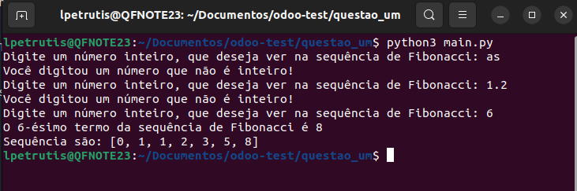
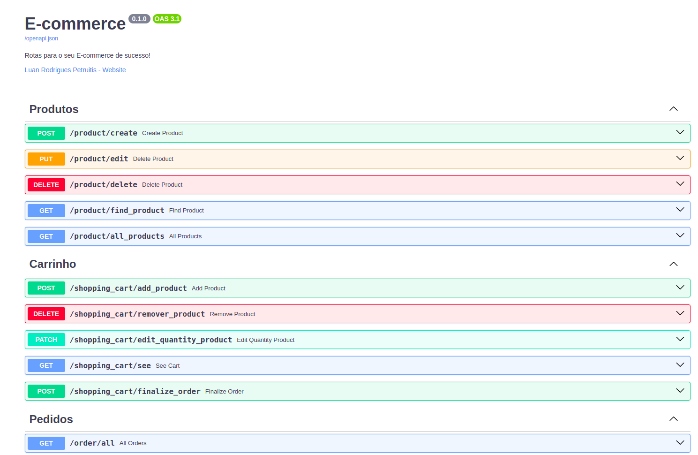
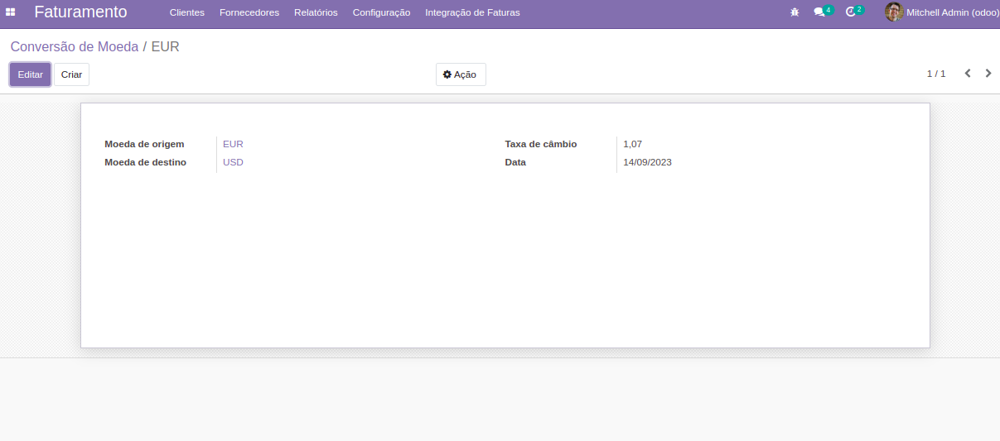
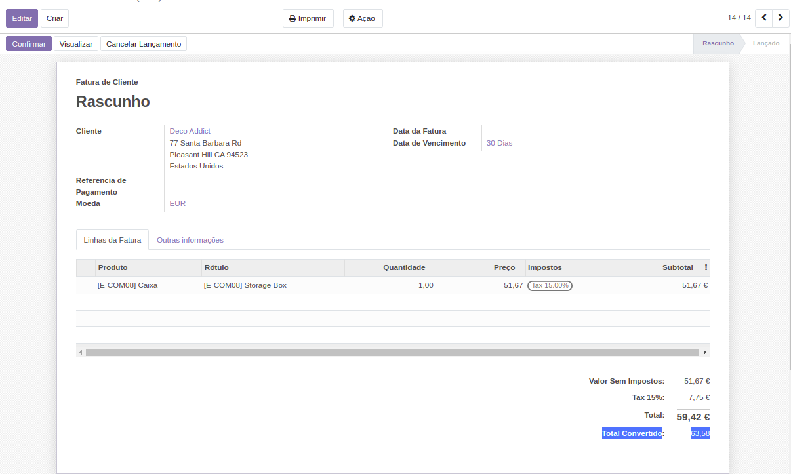
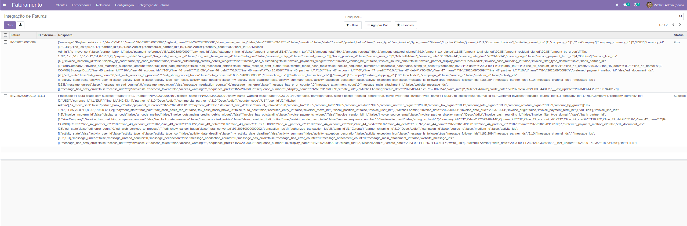

<h1 align="center">Teste de Odoo</h1>

<h3 align="center">
Teste para provar os conhecimentos em Python e Odoo
</h3>

## 🚀 Stack

- `Docker`
- `Docker Compose`
- `Python`
- `FastAPI`
- `PyMongo`
- `Uvicorn`
- `Odoo`
- `PostgreSQL`

## 🏃Preparando para execução

> Clonando repository:

```shell
git clone git@github.com:LuanPetruitis/teste-odoo.git
or com htts
git clone https://github.com/LuanPetruitis/teste-odoo.git
cd teste-odoo/
```
1) Na questão 1 é super simples para rodar, com python instalado é só entrar na pasta `questao_um` e rodar o arquivo python normalmente.

```shell
cd questao_um/
python3 main.py
```



2) Já a questão 2 como teria que fazer uma API e não foi estipulado qual era o framework eu optei por utilizar o FastAPI com o MongoDB, pois como é o que eu trabalho atualmente, consegui fazer mais rápido.

Um ponto que achei relevante implementar é a verificação se possui estoque e a atualização do estoque caso o pedido seja finalizado.

Algumas ideias para dar sequência, poderia ser por exemplo implementar um endpoint de cancelamento do pedido.




> Configurações de variáveis de ambiente

Variáveis de ambiente devem ser adicionadas ao projeto dentro da pasta **/questao_dois**. Crie o arquivo `.env` baseado no exemplo presente em `.env.sample`

## 🚆 Rodando o projeto

Use o docker-compose para instalar e iniciar o sistema localmente, com todas as suas dependências:

```bash
docker-compose down && docker-compose up --build web
```

Caso queira rodar com o debbuge do VSCode:
```bash
docker-compose down && docker-compose up --build debugpy
```
Após rodar esse comando o terminal fica aguardando que você rode o debbuge do VSCode, que eu já subi configurado dentro da pasta .vscode com nome "E-commerce V2 Docker"


## Caso queira ver a API funcionando online é só acessar o link
🔗 <a href="https://e-commerce-jw0g.onrender.com/docs" target="_blank">API E-commerce</a>

### As questões 3 e 4 quatro foram feitas tudo dentro da pasta `questao_tres_quatro`

Como não foi estipulado a versão do Odoo optei por utilizar a versão 14.0 por estar estável por mais tempo e ter mais formas de consulta.

3) Não foi preciso adicionar o campo `currency_id` no modelo `account.move`, pois ele já existia lá.

Seria possível fazer um `_rec_name` mais personalizado exemplo "EUR para USD" porém exigiria mais tempo.






4) Para a questão 4 eu criei uma API simples só para efeito de teste que você pode executar para ver funcionando a integração.

> Para rodar a API
```shell
cd Teste_integracao_Odoo/app
pip install requirements/production.txt
uvicorn main:app
```

Para acessar a documentação da API é só acesar `http://localhost:8000/docs`

Após confirmar a Fatura ele envia para a API externa e salva o retorno nesta tabela.


